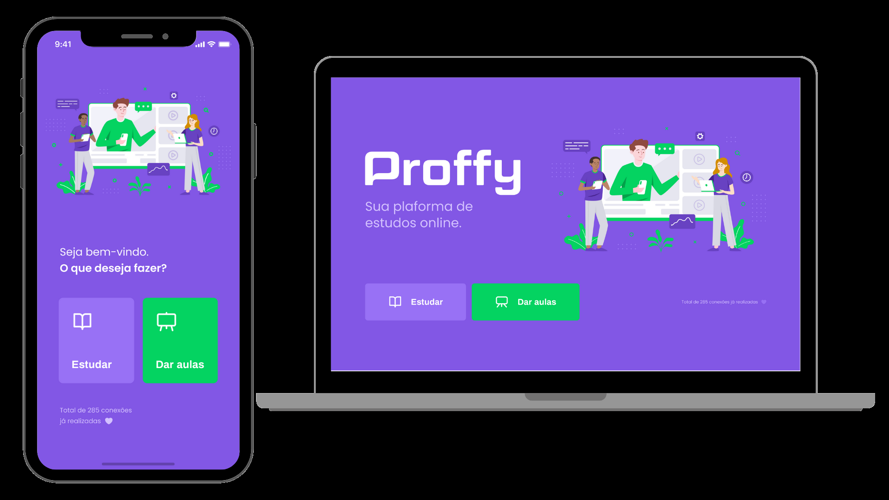

<p align="center">
   
</p>
<div align="center">
   Projeto feito na Next Level Week 2 @Rocketseat
</div>

<p align="center">
  
</p>

<p align="center">
  <a href="#clipboard-sobre-o-projeto">Sobre o Projeto</a>&nbsp;&nbsp;&nbsp;|&nbsp;&nbsp;&nbsp;
  <a href="#art-layout">Layout</a>&nbsp;&nbsp;&nbsp;|&nbsp;&nbsp;&nbsp;
  <a href="#computer-tecnologias-utilizadas">Tecnologias</a>&nbsp;&nbsp;&nbsp;|&nbsp;&nbsp;&nbsp;
  <a href="#rocket-como-rodar-o-projeto">Como rodar o projeto</a>&nbsp;&nbsp;&nbsp;|&nbsp;&nbsp;&nbsp;
  <a href="#closed-book-licença">Licença</a>
</p>

## :clipboard: Sobre o Projeto
<p align="center">
   
</p>

A proposta do projeto é uma aplicação que possa ligar quem deseja aprender, com quer ensinar. É possível encontrar alunos para o que você leciona, ou encontrar o professor para aquela matéria que você sempre quis aprender mais! Sem que haja nenhuma limitação de área!!

Criação do Proffy, uma plataforma para conexão entre professores e alunos.

## :art: Layout

Você pode duplicar o layout do projeto no Figma, ele está dividido em duas versões:

- <div style="display:flex;align-items:center;">
      Layout do projeto web <a href="https://www.figma.com/file/GHGS126t7WYjnPZdRKChJF/Proffy-Web/duplicate">  </a>
  </div>

- <div style="display:flex;align-items:center;margin-top:12px;">
      Layout do projeto mobile <a href="https://www.figma.com/file/e33KvgUpFdunXxJjHnK7CG/Proffy-Mobile/duplicate">  </a>
  </div>

## :computer: Tecnologias utilizadas

O projeto foi desenvolvido utilizando as seguintes tecnologias:

- ReactJS
- React Native
- TypeScript
- Expo
- Express

## :rocket: Como rodar o projeto

Este projeto foi dividido em três partes:

1. Back End (pasta [backend](https://github.com/mateusmaceedo/next-level-week-2.0/tree/master/backend))
2. Front End (pasta [web](https://github.com/mateusmaceedo/next-level-week-2.0/tree/master/web))
3. Mobile (pasta [mobile](https://github.com/mateusmaceedo/next-level-week-2.0/tree/master/mobile))

💡Tanto o Front End quanto o Mobile precisam que o Back End esteja sendo executado para funcionar.

### Pré-requisitos

Antes de começar, você vai precisar ter instalado em sua máquina as seguintes ferramentas:

- [Git](https://git-scm.com);
- [Node.js](https://nodejs.org/en/);
- [Editor de código](https://code.visualstudio.com/)

## Clonando o projeto

Comece realizando um clone deste projeto.

```bash
# Clone este repositório
$ git clone https://github.com/MateusMaceedo/next-level-week-2.0.git

# Acesse a pasta do projeto no seu terminal/cmd
$ cd nlw-2-rocketseat
```

## Rodando o back end (servidor)

```bash
# Vá para a pasta da aplicação Back-End
$ cd backend

# Instale as dependências
$ yarn
# Ou use NPM se preferir
$ npm install

# Rode as migrations do banco de dados
$ yarn knex:migrate
# Ou use NPM
$ npm run knex:migrate

# Execute a aplicação em modo de desenvolvimento
$ yarn start
# Ou use NPM se preferir
$ npm run start

# A aplicação será aberta na porta:3333
```

### Rodando a aplicação web (Front End)

```bash
# Vá para a pasta da aplicação Front-End
$ cd web

# Instale as dependências
$ yarn
# Ou use NPM se preferir
$ npm install

# Execute a aplicação em modo de desenvolvimento
$ yarn start
# Ou use NPM se preferir
$ npm run start

# A aplicação será aberta na porta:3000 - acesse http://localhost:3000
```

### Rodando a aplicação mobile

```bash
# Vá para a pasta da aplicação Mobile
$ cd mobile

# Instale as dependências
$ yarn
# Ou use NPM se preferir
$ npm install

# Execute a aplicação em modo de desenvolvimento
$ yarn start
# Ou use NPM se preferir
$ npm run start

# Instale o aplicativo Expo no seu celular
# Escaneie o QrCode para abrir a aplicação
```


## 👨🏻‍🚀 Sobre mim
<a href="https://www.linkedin.com/in/mateus-macedo-937a32163/">
 
 <p>Mateus Macedo</p>
</a>

## 💜 Agradecimentos
Obrigado [Rocketseat](https://rocketseat.com.br) por disponibilizar esse conteúdo de maneira acessível a todos🚀.
